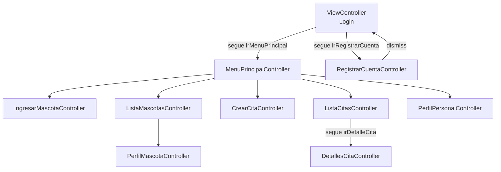
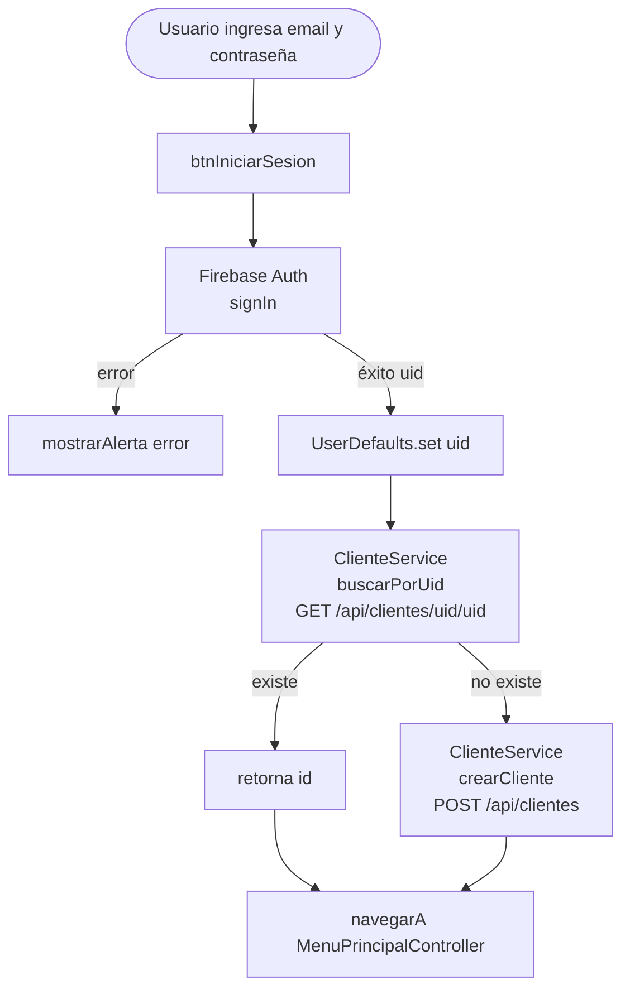
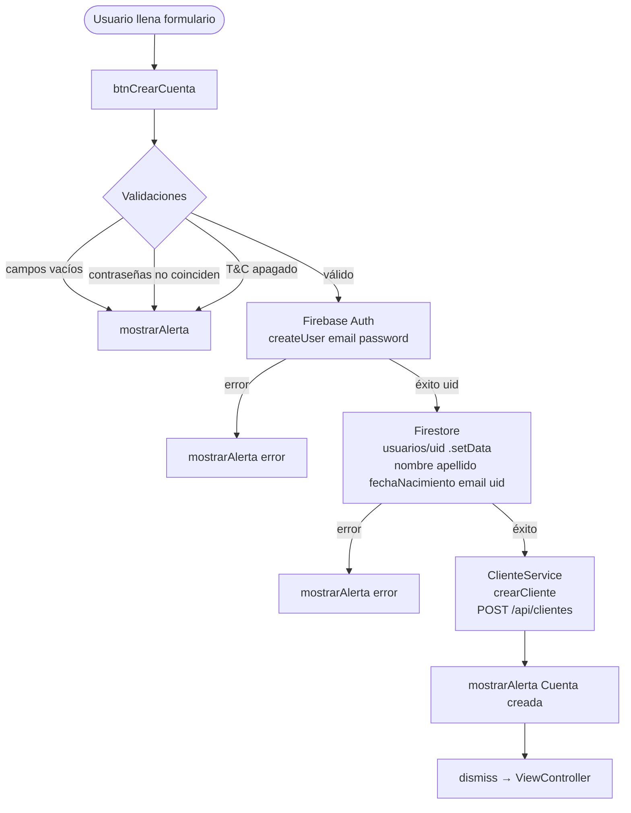
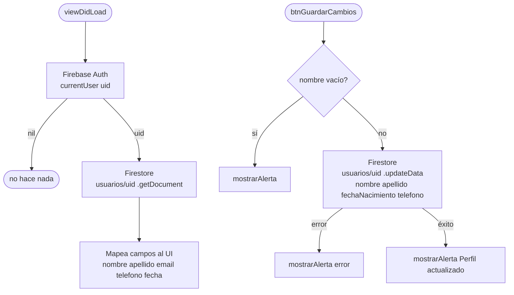
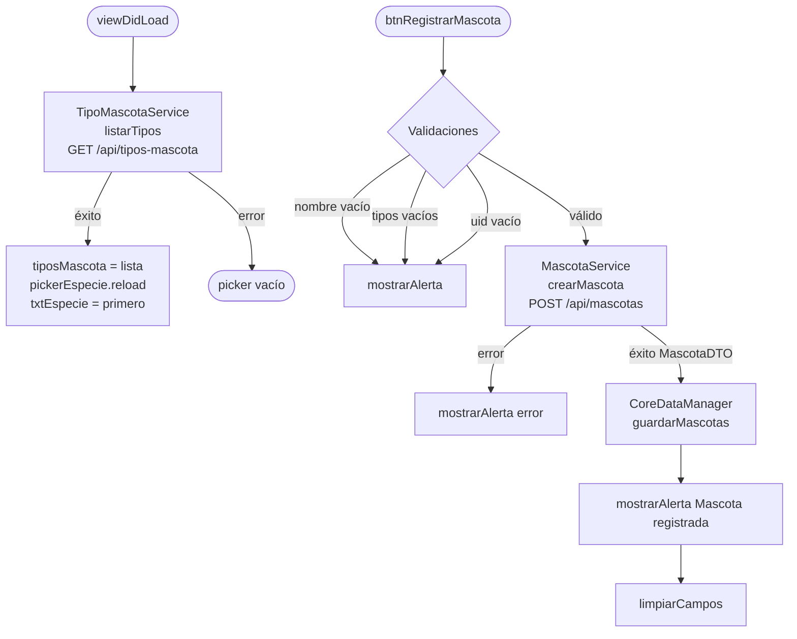
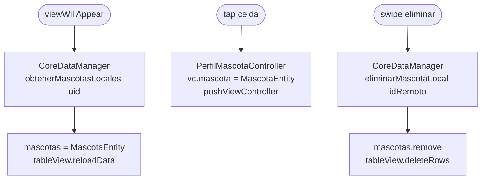
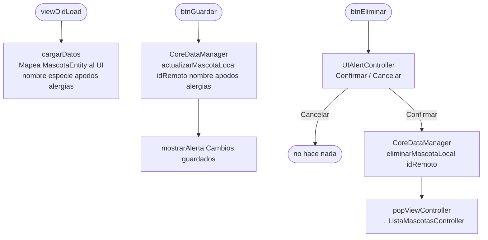
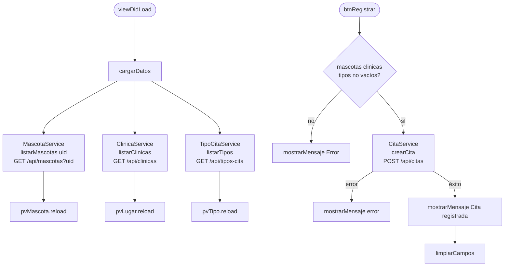
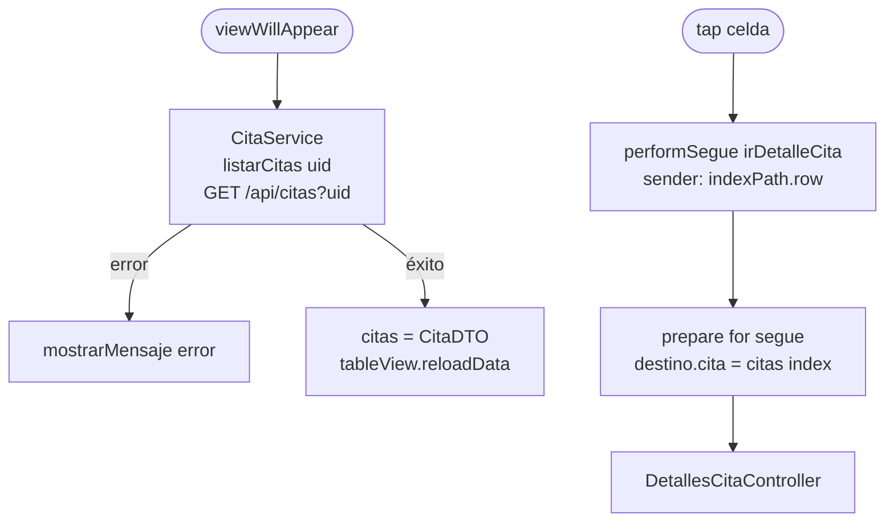
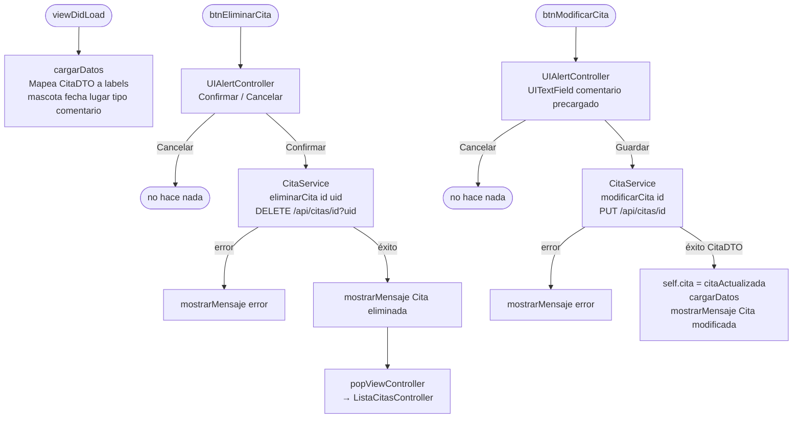

# Diagramas Mermaid — Suri Firuvet 🐾

---

## Navegación general

---

## Login — ViewController

---

## Registro — RegistrarCuentaController

---

## Perfil Personal — PerfilPersonalController

---

## Mascotas — IngresarMascotaController

---

## Mascotas — ListaMascotasController

---

## Mascotas — PerfilMascotaController

---

## Citas — CrearCitaController

---

## Citas — ListaCitasController

---

## Citas — DetallesCitaController

